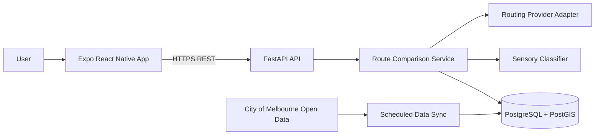

# CalmPath App Development Requirements

**Project:** Sensory-Friendly Urban Futures  
**Team:** FIT5120 TA28  
**Technology stack:** React Native (Expo), FastAPI, PostgreSQL/PostGIS  
**Version:** 1.0  
**Date:** 4 August 2026  
**Status:** Development baseline

## 1. Purpose

This document consolidates the project requirements, Discovery Presentation, Figma prototype, acceptance criteria, and FIT5120 onboarding guidelines into an implementable development baseline.

CalmPath is a sensory-aware wayfinding application for commuters travelling through Melbourne CBD. Instead of optimising only for travel time, it compares candidate walking routes using pedestrian congestion data and helps users choose a route with comparatively lower crowd exposure.

The product is intended to support sensory-sensitive and neurodivergent adults who may experience stress from crowds, noise, construction, unexpected route changes, and other high-stimulation urban conditions.

## 2. Product Goals

- Reduce exposure to heavily congested pedestrian corridors.
- Reduce the need to check several applications before travelling.
- Help users travel independently and arrive in a calmer state.
- Translate pedestrian data into clear and understandable route information.
- Explain why a route is recommended rather than presenting a black-box result.
- Establish an extensible foundation for preferences, sensory refuge locations, and future predictive alerts.

## 3. Product Principles

### 3.1 Honest use of data

The application must not guess a sensory level when sufficient data is unavailable. Missing or stale data must result in an explicit `Sensory information unavailable` state.

### 3.2 Explainable recommendations

Every recommendation must include a short explanation, such as lower pedestrian congestion, avoidance of a busy corridor, or comparatively lower congestion when all routes are busy.

### 3.3 Not dependent on colour

Sensory levels must always be communicated through text. Colour and icons may be used as supporting cues but must not be the only way the information is conveyed.

### 3.4 User control

The application may recommend a route, but the user must remain free to select another option. Error and empty states must provide a clear next action.

### 3.5 Privacy by default

The MVP does not require user accounts. Exact location and sensory preference information must not be retained longer than necessary to complete a request.

## 4. Scope

### 4.1 Committed MVP

| Priority | User story | Delivery status |
|---|---|---|
| Must Have | US 1.1 - Display a sensory indicator for each route | Committed build scope |
| Must Have | US 1.2 - Identify and avoid highly congested pedestrian corridors | Committed build scope |

### 4.2 Conditional and future scope

| Priority | User story | Delivery status |
|---|---|---|
| Should Have / Stretch | US 2.1 - Display nearby sensory refuge locations | Implement only after the Must Have scope is complete and stable |
| Could Have / Prototype Only | US 1.3 - Apply a personal crowd-sensitivity threshold | May remain in the prototype; not committed for the onboarding build |
| Won't Have This Iteration | US 2.2 - Predict crowd conditions for the next hour | Future backlog; no ML or AI model in this iteration |

### 4.3 Scope decision

The earlier project requirements include dynamically adjusting routes when crowd levels exceed a user-defined threshold. However, the later Discovery Presentation and the prototype acceptance criteria classify US 1.3 as a Could Have, prototype-only feature. The current build therefore does not require personalised dynamic thresholds.

### 4.4 Out of scope for the MVP

- User registration, login, and cross-device profile synchronisation.
- Long-term storage of health, disability, or sensory preference data.
- Full turn-by-turn GPS navigation and background location tracking.
- Offline maps.
- Live public transport timetable integration.
- Automatic inference of construction, protests, policing activity, or other stressors without a reliable data source.
- Machine-learning predictions and next-hour alerts.
- Medical advice or guarantees that a route is safe, quiet, or congestion-free.

## 5. Target User and Primary Journey

### 5.1 Primary persona

Freddy is a 28-year-old neurodivergent commuter in Melbourne. He relies on trains and trams, values independent travel, and can become overwhelmed by crowds, noise, construction, and unexpected route changes. He currently checks several apps and mentally prepares backup routes before travelling. He does not necessarily want the fastest route; he wants a route that helps him arrive calm and prepared.

### 5.2 MVP journey

1. The user opens CalmPath without being required to sign in.
2. The user selects a current location and enters or selects a destination in Melbourne CBD.
3. The client requests candidate walking routes from the backend.
4. The backend matches route segments with recent pedestrian observations.
5. The rule engine calculates congestion scores and data coverage.
6. Each route receives a `Low Sensory`, `High Sensory`, or `Unavailable` status.
7. The results screen displays route duration, sensory level, recommendation status, and explanation.
8. The user selects a route and opens its map and congested-segment details.

## 6. Functional Requirements

### FR-01: Origin and destination

- The user must be able to select or enter an origin and a destination.
- Locations must be represented by coordinates or controlled place identifiers.
- The destination must be inside the configured Melbourne CBD service boundary.
- Both the client and backend must validate input.
- Invalid input must produce a field-level error without clearing the user's existing values.
- The submit button must show a loading state and prevent duplicate requests.

### FR-02: Candidate route generation

- A valid request must return at least one candidate walking route, with a target of two alternatives for comparison.
- Every route must include an identifier, name, estimated duration, distance, and line geometry.
- The routing provider must be isolated behind an adapter so it can be replaced without changing the client API.
- A controlled set of demonstration routes may be used for the onboarding MVP if a production routing provider has not yet been approved.
- All routes in one comparison must use the same data snapshot and classification-rule version.

### FR-03: Pedestrian-data ingestion

- The backend must ingest City of Melbourne pedestrian sensor locations.
- The backend must ingest the latest available pedestrian counts per minute or per hour.
- Every imported record must retain its source, observation time, synchronisation run, and quality status.
- Synchronisation must be idempotent and safe to retry.
- An incomplete import must not replace the last successful active snapshot.

### FR-04: Route-to-sensor matching

- Candidate routes must be divided into analysable segments.
- Valid pedestrian sensors within a configurable distance of a segment must be associated with that segment.
- The system must record the number of sensors and data coverage used for each route.
- Observations older than the configured maximum age must not be used for classification.
- Areas without sensor coverage must not automatically be treated as low sensory.

### FR-05: Sensory classification

The current iteration must use a transparent, rule-based method rather than machine learning.

| Classification | Rule |
|---|---|
| Low Sensory | Data coverage meets the minimum requirement and the route crowd score is below the configured threshold |
| High Sensory | Data coverage meets the minimum requirement and the route crowd score is equal to or above the configured threshold |
| Unavailable | The route does not have sufficient, recent, or valid pedestrian data |

Classification thresholds, minimum coverage, maximum data age, and the active rule version must be stored as configuration and covered by automated tests.

### FR-06: Route recommendation

- The system must recommend the valid route with the lowest crowd score.
- The response must explain why the route was recommended.
- A shorter route must not be recommended solely because it is faster when it has higher crowd exposure.
- If every route is congested, the system must identify the comparatively lower-congestion option.
- In the all-routes-congested state, the application must explicitly state that the recommended route is not congestion-free.
- A route with unavailable sensory data must not receive a sensory-based recommendation.

### FR-07: Route results

Each route card must display:

- Route name.
- Estimated duration.
- Distance, where useful.
- `Low Sensory`, `High Sensory`, or `Sensory information unavailable` text.
- Recommendation status.
- A short explanation.
- The time or freshness status of the pedestrian data.

### FR-08: Route map and details

- The route detail screen must display the selected route, origin, and destination.
- Congested segments must be identifiable on the map.
- Equivalent route and congestion information must also be available as text.
- The map must not be the only way to understand the recommendation.
- The user must be able to return to the route comparison screen.

### FR-09: Sensory refuge locations - Stretch

- The system may search for parks, libraries, quiet public spaces, and similar candidate locations near the selected route.
- Each location must include a name, category, address, distance, data source, and any verifiable facility information.
- A location must not be described as guaranteed quiet unless this is supported by an authoritative source.
- The user may select a location and view a simplified route from the current journey.
- If no locations are found, the application must display `No quiet places nearby` and provide an action to return to the route.

## 7. Error and Edge States

| Situation | Required behaviour | Recovery action |
|---|---|---|
| One route has no usable data | Display `Sensory information unavailable`; do not show a sensory recommendation | View another route or retry |
| All routes are congested | Explain that all routes contain congestion and identify the comparatively lower option | Compare and choose a route |
| Destination is invalid or outside the CBD | Display a field-level validation error and preserve the input | Edit the destination |
| Open-data service is unavailable | Display data freshness and temporary-unavailability information | Use a still-valid cached snapshot or retry later |
| No walking route is available | Explain that no route was found | Change the origin or destination |
| No refuge location is nearby | Display the empty state without inventing a location | Expand the search or return to the route |

## 8. React Native Frontend Requirements

### 8.1 Technology

- React Native with TypeScript.
- Expo as the build and development platform.
- Expo Router for navigation.
- TanStack Query or an equivalent library for server state.
- Zod or an equivalent schema validator for client-side response validation.
- OpenAPI-generated client types where practical.

### 8.2 Screens

| Screen | Purpose | Scope |
|---|---|---|
| `PreferenceSetupScreen` | Select low, moderate, or high crowd sensitivity | Prototype only unless US 1.3 is promoted |
| `DestinationScreen` | Select origin and destination | MVP |
| `RouteResultsScreen` | Compare routes, labels, duration, and explanations | MVP |
| `RouteMapScreen` | View the route and congested segments | MVP |
| `QuietPlacesScreen` | Select a nearby refuge candidate | Stretch |
| `QuietPlaceDetailScreen` | View place details and the route to it | Stretch |

### 8.3 Accessibility

- Interactive targets should be at least 44 by 44 points.
- The application must support dynamic text sizing without clipping critical content.
- Text and background contrast must meet WCAG 2.1 AA.
- Every icon, route label, map marker, and action must have an accessible label.
- Focus order must follow the visual reading order.
- Sensory levels must use text and must not depend on red/green colour alone.
- Motion must respect the user's reduced-motion preference.
- The interface must avoid flashing, unexpected movement, and unnecessary stimulation.
- The core flow must remain usable with keyboard navigation and a screen reader on supported platforms.

### 8.4 Client state

- Server responses, caching, retry behaviour, and freshness should be managed as server state.
- Selected routes and temporary interface values should remain local client state.
- The MVP must not persist an exact journey history by default.
- Rendering failures must be caught by an error boundary that provides a recovery action.

## 9. FastAPI Backend Requirements

### 9.1 Responsibilities

- Validate all client input with Pydantic.
- Validate the configured service boundary.
- Orchestrate the routing provider, pedestrian-data repository, classification rules, and recommendation explanation.
- Expose a stable, versioned REST API.
- Run or coordinate scheduled open-data synchronisation.
- Provide structured logs, health checks, metrics, and OpenAPI documentation.
- Avoid exposing internal errors, SQL, credentials, or precise user-location data in logs.

### 9.2 API endpoints

| Method and path | Purpose | Main response |
|---|---|---|
| `GET /api/v1/health` | Liveness and readiness | API, database, and data-freshness status |
| `POST /api/v1/routes/compare` | Generate and compare candidate routes | Routes, recommendation, explanations, and data snapshot |
| `GET /api/v1/routes/{route_id}` | Retrieve route details | Route segments, sensor coverage, and explanation |
| `GET /api/v1/refuges` | Find refuge candidates near a route or point | Place summaries; Stretch |
| `GET /api/v1/refuges/{place_id}` | Retrieve refuge details | Place, category, address, facilities, and source; Stretch |
| `POST /internal/data-sync` | Trigger a protected synchronisation job | Internal use only; not exposed to the public app |

### 9.3 Route comparison response

Each returned route must contain at least:

- `id`
- `name`
- `duration_minutes`
- `distance_meters`
- `geometry`
- `sensory_level`
- `crowd_score`, nullable when data is unavailable
- `data_coverage`
- `is_recommended`
- `explanation`
- `congested_segments`
- `data_updated_at`
- `rule_version`

### 9.4 Error contract

| HTTP status | Error code | Meaning |
|---|---|---|
| 400 | `INVALID_LOCATION` | Invalid coordinates or identical origin and destination |
| 422 | `OUTSIDE_SERVICE_AREA` | Destination is outside the configured CBD boundary |
| 404 | `NO_ROUTE_FOUND` | No candidate walking route is available |
| 429 | `RATE_LIMITED` | Request limit exceeded |
| 503 | `DATA_SOURCE_UNAVAILABLE` | No sufficiently fresh open-data snapshot is available |
| 500 | `INTERNAL_ERROR` | Generic production error without internal implementation details |

## 10. PostgreSQL and PostGIS Requirements

PostgreSQL must be used as the primary database. PostGIS should be enabled for points, routes, distance searches, buffers, and intersection queries.

### 10.1 Core entities

| Entity | Key fields | Purpose |
|---|---|---|
| `data_sources` | `id`, `name`, `url`, `licence`, `refresh_interval` | Open-data source registry |
| `sync_runs` | `id`, `source_id`, timestamps, `status`, `row_count`, `error` | Synchronisation audit |
| `pedestrian_sensors` | `id`, `external_id`, `name`, `geom`, `active` | Sensor locations |
| `pedestrian_observations` | `sensor_id`, `observed_at`, `count`, `interval`, `quality_flag`, `sync_run_id` | Time-series pedestrian counts |
| `places` | `id`, source identifiers, `name`, `category`, `address`, `geom`, `metadata` | Landmarks and refuge candidates |
| `route_requests` | `id`, origin, destination, snapshot, `rule_version` | Optional short-lived anonymous request audit |
| `route_options` | `id`, `request_id`, duration, distance, `geom`, score, level, coverage, recommended | Route comparison result |
| `route_segments` | `id`, `route_id`, sequence, `geom`, score, level, sensor count | Explainable segment analysis |
| `classification_rules` | version, threshold, minimum coverage, maximum data age, active status | Versioned rule configuration |

### 10.2 Constraints and indexes

- `pedestrian_observations` must have a unique constraint on `(sensor_id, observed_at)`.
- Pedestrian counts must not be negative.
- Spatial columns must use SRID 4326 unless a documented projected coordinate system is required for calculations.
- Spatial columns must have GiST indexes.
- Observations must have an index on `(sensor_id, observed_at DESC)`.
- Times must be stored as `timestamptz` in UTC and returned as ISO 8601 values.
- The API database role must not have schema-migration privileges.
- Database migrations must be managed through Alembic.

### 10.3 Retention

- Exact route requests and derived route results should have a short retention period, recommended as 24 hours, or be disabled when not required.
- Analytics should use aggregate information rather than identifiable journey histories.
- Logs must remove coordinates or reduce their precision.

## 11. System Architecture



### 11.1 Suggested repository structure

```text
apps/
  mobile/              # Expo React Native application
services/
  api/                 # FastAPI service
packages/
  contracts/           # Generated API types and shared schemas
infra/                 # Deployment and database configuration
docs/                  # ERD, architecture, testing and maintenance notes
.github/workflows/     # CI pipelines
```

## 12. Web and Mobile Delivery Decision

The FIT5120 specification contains two relevant statements:

1. The build guidelines list a `Web-based application`.
2. The submission section permits either a web link to a deployed build or downloadable executable app files.

These statements create an ambiguity rather than a clear prohibition on mobile apps.

The product may remain a React Native mobile application. However, the team must confirm with the tutor or mentor whether a mobile executable alone satisfies the onboarding build requirement.

Recommended risk-control approach:

- Keep Expo Web compatibility during development.
- Use the mobile application as the primary product experience.
- Provide a fixed Expo Web deployment link if the teaching team confirms that a web build is required.
- Do not commit publicly to both delivery targets until the mentor confirms the expected submission form.

## 13. Non-Functional Requirements

| Category | Requirement |
|---|---|
| Performance | Cached route comparisons should complete within 2 seconds at P95; cold requests should complete within 5 seconds at P95 |
| Capacity | MVP target: 50 concurrent users and a configurable limit of approximately 10 comparison requests per minute per client |
| Reliability | Dependency failures must produce a recoverable state rather than a broken screen |
| Compatibility | Test on current Chrome and Edge for Expo Web if delivered, plus at least one Android and one iOS environment for mobile delivery |
| Accessibility | Meet WCAG 2.1 AA for the core flow; support text labels, keyboard use, screen readers, and 200% zoom where applicable |
| Security | HTTPS, input validation, parameterised queries, rate limiting, dependency scanning, and least-privilege database access |
| Privacy | No account required; no long-term exact-location history; coordinates removed or reduced in logs |
| Maintainability | Target at least 80% automated coverage for critical domain rules; maintain OpenAPI documentation and migrations |
| Observability | Structured logs with request IDs; health checks must distinguish API, database, and data-freshness failures |
| Traceability | Every Must Have acceptance criterion must map to at least one automated or documented manual test |

## 14. Security, Privacy, and Ethics

### 14.1 Required controls

- Validate and constrain coordinates, text input, request size, and query frequency.
- Use SQLAlchemy parameterised queries.
- Configure CORS with explicit development and production origins.
- Enforce HTTPS in deployed environments.
- Do not expose stack traces, SQL, connection strings, or provider credentials.
- Run Bandit, frontend linting, and dependency-vulnerability scans in CI.
- Block merges when unresolved high-severity findings are present.
- Conduct an OWASP ZAP baseline scan before the main demonstration or submission.
- Document findings, severity, owner, remediation, and retest results.

### 14.2 Ethical requirements

- A route recommendation is a comparison based on available data, not a guarantee of safety or comfort.
- Lack of sensors must not be interpreted as lack of congestion.
- The application must display data freshness and coverage limitations.
- Sensory or disability-related information must not be used to disadvantage users.
- Refuge locations must be described conservatively and supported by source data.

## 15. Acceptance Criteria

### AC 1.1.1 - Sensory labels

**Given** the user has entered a valid destination,  
**when** route options are displayed,  
**then** each route with sufficient data must show a clearly labelled `High Sensory` or `Low Sensory` indicator.

### AC 1.1.2 - Text, not colour alone

**Given** a sensory indicator is displayed,  
**when** the user views the route,  
**then** the indicator must be communicated using text and not colour alone.

### AC 1.1.3 - Unavailable data

**Given** sensory data is unavailable for a route,  
**when** the route is displayed,  
**then** the system must show `Sensory information unavailable`.

### AC 1.2.1 - Congested segments

**Given** pedestrian-density data is available,  
**when** the system analyses possible routes,  
**then** highly congested route segments must be identified.

### AC 1.2.2 - Lower-congestion recommendation

**Given** a lower-congestion alternative route is available,  
**when** route options are displayed,  
**then** the system must recommend the lower-congestion route.

### AC 1.2.3 - All routes congested

**Given** all available routes contain congestion,  
**when** route options are displayed,  
**then** the system must identify the comparatively lower-congestion route without describing it as congestion-free.

### Prototype acceptance criteria for US 1.3

The following criteria apply to the prototype only unless US 1.3 is formally promoted into the build scope:

- The prototype shows that a selected crowd-sensitivity preference would be used to assess route suitability.
- The prototype demonstrates how a lower-stimulation route would be recommended when crowd density exceeds the selected preference.

## 16. Test Requirements

### 16.1 Backend tests

- Classification below, equal to, and above the configured threshold.
- Data coverage immediately below and exactly at the minimum.
- Observations immediately inside and outside the maximum-age boundary.
- Negative counts, duplicate observations, invalid timestamps, and future timestamps.
- One unavailable route, all unavailable routes, and all congested routes.
- Correct recommendation when the faster route is more congested.
- Service-boundary validation.
- Rate limiting and production-safe error responses.

### 16.2 Frontend tests

- Loading, success, empty, unavailable-data, and retry states.
- Sensory text is present without relying on colour.
- Recommendation and explanation content match the API response.
- Keyboard focus order and screen-reader labels.
- Large text, reduced motion, colour-blindness simulation, and weak-network behaviour.
- Duplicate submissions are prevented.

### 16.3 End-to-end tests

- Valid destination to route comparison.
- Selection of the recommended lower-congestion route.
- A route with unavailable sensory data.
- The all-routes-congested state.
- Invalid or out-of-area destination recovery.
- Refuge selection and no-results recovery if US 2.1 is included.

## 17. Engineering Quality and CI/CD

### 17.1 Required checks

- Frontend: ESLint, Prettier, TypeScript, Jest, and React Native Testing Library.
- Backend: Ruff or Flake8, Black, mypy, Pytest, and database integration tests.
- OpenAPI contract validation between the backend and generated frontend types.
- Security and dependency scanning.
- Peer review before merge.

### 17.2 Merge and release gates

- Lint, type checks, tests, and security checks must pass before merge.
- At least one team member must review each pull request.
- Critical and high-priority defects must be resolved before release.
- Database migrations must complete successfully before a deployment becomes active.
- A staging smoke test must cover the complete Must Have journey.
- The submitted build link must remain stable after submission.

## 18. Definition of Done

The onboarding build is complete when:

- US 1.1 and US 1.2 acceptance criteria pass.
- LeanKit, the Discovery Presentation, test cases, and the implemented build describe the same functionality.
- The application provides at least one sensory-aware route based on pedestrian-density data.
- High, Low, and Unavailable states are displayed correctly.
- The system identifies congested segments and recommends the comparatively lower-congestion route.
- Database migrations and data scripts can initialise the project reproducibly.
- The core journey has no known critical or high-priority defects.
- Accessibility and usability checks have been completed with representative or closest-available users.
- Code, ERD, architecture, tests, security results, and necessary maintenance instructions are documented.
- Mentor feedback has been implemented or a professional rationale for not adopting it has been recorded.

## 19. Risks and Open Decisions

| Item | Risk | Required action |
|---|---|---|
| Routing provider not confirmed | Dynamic routes cannot be generated reliably | Use an adapter and confirm the formal provider early; controlled CBD demo routes may support the MVP |
| High/Low threshold not confirmed | Acceptance results may be inconsistent | Confirm the threshold, minimum coverage, maximum data age, and rule owner before implementation |
| Meaning of “real-time” | Users may be misled by delayed data | Display update time and use `recent` or `near-real-time` terminology accurately |
| Web versus mobile delivery | The specification contains ambiguous requirements | Obtain written confirmation from the tutor or mentor; keep Expo Web compatibility until resolved |
| Refuge locations may not be quiet | Trust and ethical risk | Present them as candidates and display only verifiable characteristics |
| Open-data licence and attribution | Publication compliance risk | Record dataset URL, licence, attribution, and synchronisation date |
| Tight onboarding timeline | Stretch work may destabilise the MVP | Enforce Must-Have-first delivery; US 2.1 must not block US 1.1 or US 1.2 |

## 20. Decisions Required Before Development

1. Confirm the formal Melbourne CBD service boundary and demonstration locations.
2. Confirm the High Sensory threshold, minimum data coverage, maximum observation age, and rule-version owner.
3. Select the routing provider and verify its licence and request limits.
4. Ask the tutor or mentor whether a mobile executable alone is acceptable or whether an Expo Web deployment is required.
5. Confirm whether US 2.1 is included in the onboarding build.
6. If US 2.1 is included, agree which place categories may be presented as sensory refuge candidates.

## 21. Source Documents

- `FIT5120 Onboarding Specification and Guidelines 2026 S2.docx (1).pdf`
- `Onboarding requirements.pdf`
- `FIT5120_TA28_Discovery_Presentation_Week2.pptx.pdf`
- `Figma and Acceptance Criteria.docx`

This document is a development baseline and does not replace LeanKit. Functional requirements, acceptance criteria, test cases, and implementation tasks should be linked in both directions. Any mentor-approved scope change must be reflected in this document, LeanKit, the presentation, and the deployed build.
